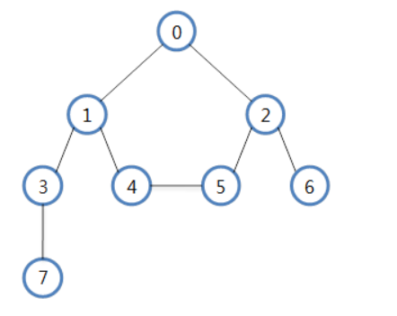

:x: 다시풀기

## 01. 나열된 수에서 최솟값과 최댓값 구하기

### 문제 정의
- 여러 개의 수가 배열에 있을 때 그 중 가장 큰 값과 가장 작은 값을 찾는다.

- 배열의 몇 번째에 있는지 순서를 찾는다.

- 반복문을 한번만 사용하여 문제를 해결한다.

- 수의 예 : [10, 55, 23, 2, 79, 101, 16, 82, 30, 45]

## 02. 정렬된 수에서 하나의 수의 위치 찾기

### 문제 정의

- 여러 개의 수가 정렬된 순서로 있을 때 특정한 수를 찾는 방법

- 단순 반복문을 이용하면 수의 개수에 따라 비교 횟수가 증가하는 O(n)의 수행이 이루어짐

- 수가 정렬된 상태에서는 이진 탐색(binary search)을 활용하면 매번 비교되는 요소의 수가 절반으로 감소될 수 있으므로 O(logN)의 수행으로 원하는 수를 찾을 수 있음

- 수의 예 : [12, 25, 31, 48, 54, 66, 70, 83, 95, 108]

- 83의 위치를 찾아보세요

- 88의 위치를 찾아보세요

### 해결방법

- 이진탐색
  - 데이터가 정렬된 배열에서 특정한 값을 찾아내는 알고리즘
  - 배열의 중간 값을 선택해 찾고자 하는 값 X와 비교
  - 한번 비교할 때 마다 1/2씩 범위가 좁아짐

## 03. 정렬 알고리즘

### 평균 수행 시간이 O(n^2)인 알고리즘

- 버블 정렬(Bubble Sort), 삽입 정렬(Insertion Sort), 선택 정렬(Selection Sort)

- 각 요소가 다른 요소와 평균 한번 이상씩 비교를 하여 정렬 됨

#### Bubble sort

- 배열의 두 수를 선택한 뒤, 그 두 수가 정렬되어있다면 유지, 아니면 두 수를 바꾸는 방식(처음부터 끝까지 반복)

#### :x: Insertion sort

- 모든 요소를 앞에서부터 차례대로 이미 정렬된 부분과 비교하여 자신의 위치를 찾아 삽입

#### :x: Selection Sort

- 제자리 정렬 알고리즘
- 배열에서 최소값을 찾아서 그 값을 맨 앞과 교체, 맨 처음 위치를 뺀 나머지 배열과 반복하여 교체

### 평균 수행 시간이 O(logN)인 알고리즘

- 퀵 정렬(Quick Sort), 병합 정렬(Merge Sort), 힙 정렬(Heap Sort)

- 한번 수행될 때마다 정렬되어야 하는 수의 범위가 1/2로 줄어드는 경우

- 퀵 정렬 이외의 다른 알고리즘은 추가적인 메모리가 필요함

#### :x: Quick Sort

- 배열을 피벗을 기준으로 두개의 부분 리스트로 나누고, 하나는 피벗보다 작은 부분 리스트, 다른 하나는 피벗보다 큰 값의 부분 리스트로 나눔
- 각 부분리스트에 대해 위처럼 재귀적으로 수행

#### :x: Heap Sort

- 최대 힙을 구현한 뒤, 루트 노드를 맨 마지막 노드로 넣어준 후 깨진 힙을 재 구조화하는 과정을 반복
1. 최대힙을 구현(downHeap)
2. 최대힙의 루트 노드를 배열 마지막 값과 교환(swap)
3. 마지막 요소를 제외한 크기가 n - 1인 힙을 다시 재 구조화
4. 1~2번 반복하여 힙 정렬 구현

#### :x: Merge Sort

- 추가로 배열을 하나 더 사용해야함
1. 리스트의 길이가 0, 1이면 이미 정렬된것으로 봄
2. 정렬되지 않은 리스트는 절반으로 잘라 비슷한 크기의 두 부분 리스트로 나눔
3. 각 부분 리스트를 재귀적으로 합병 정렬을 이용해 정렬
4. 두 부분 리스트를 다시 하나의 정렬된 리스트로 합병

# 04. DFS(Depth - First Search)와 BFS(Breadth - First Search)

## 그래프 탐색

### 깊이 우선 탐색(DFS)

- 인접한 노드를 우선 탐색 하는 방식

- 스택을 활용하여 구현할 수 있음

- DFS 탐색 순서 :
  0 - 1 - 3 - 7 - 4 - 5 - 2 - 6 or
  0 - 2 - 6 - 5 - 4 - 1 - 3 - 7     

### 너비 우선 탐색(BFS)

- 한 노들에 모든 인접한 노드를 탐색하는 방식

- 큐를 활용하여 구현할 수 있음

- BFS 탐색 순서 : 0 - 1 - 2 - 3 - 4 - 5 - 6 - 7

# 05. 다익스트라 알고리즘

- 다이나믹 프로그래밍을 활용한 대표적인 최단 경로 탐색 알고리즘
  - 최단거리는 여러개의 최단거리로 이루어져있기 때문

- 하나의 최단 거리를 구할 때 그 이전까지 구했던 최단거리 정보를 그대로 사용

- 방향 그래프를 ArrayList를 이용해서 구현

- 우선순위 큐를 이용
